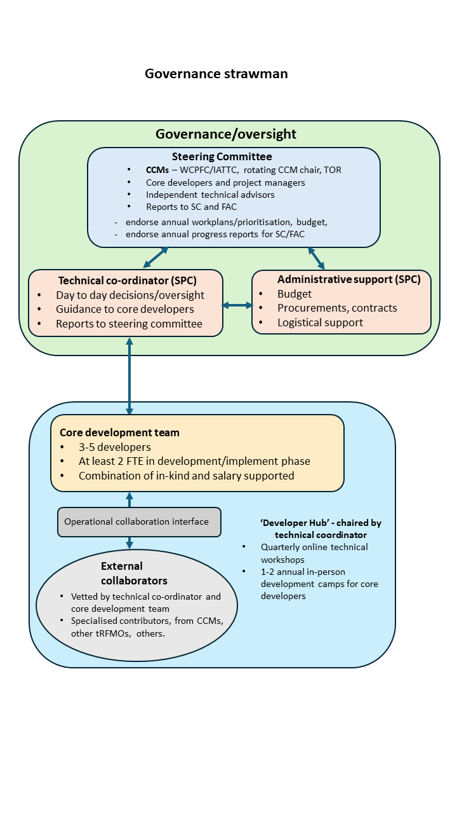

opal is developed under [WCPFC Project 123](https://www.wcpfc.int/) --- *scoping the next generation of tuna stock assessment software*. Project 123 is a three-year (2027--2029) effort to take opal from a proof of concept toward a platform capable of supporting operational tuna stock assessments.

## Proposed governance

The proposed governance structure separates strategic oversight, day-to-day coordination, and hands-on development, and reports into the existing WCPFC committee structure.

**Steering Committee.** Commission members and cooperating non-members (CCMs) from WCPFC and IATTC, with a rotating CCM chair and agreed terms of reference, together with the core developers, project managers, and independent technical advisors. The committee endorses annual work plans, prioritisation, and budget, and endorses annual progress reports. It reports to the WCPFC Scientific Committee (SC) and Finance and Administration Committee (FAC).

**Technical coordinator (SPC).** Day-to-day oversight and decisions, and guidance to the core developers; reports to the Steering Committee.

**Administrative support (SPC).** Budget, procurement and contracts, and logistical support.

**Core development team.** Three to five developers, with at least two full-time equivalents (FTE) during the development and implementation phase, supported through a combination of in-kind and salaried contributions.

**External collaborators.** Specialised contributors from CCMs, other tuna RFMOs, and elsewhere, vetted by the technical coordinator and the core development team.

**Developer Hub.** Chaired by the technical coordinator, comprising quarterly online technical workshops and one to two annual in-person development camps for the core developers.

## People & partner organizations

**Core development team.** Nicholas Ducharme-Barth (NOAA Fisheries, PIFSC), Darcy Webber (Quantifish), and Philipp Neubauer (Dragonfly Data Science).

**Coordination and collaboration.** The Pacific Community (SPC) provides project coordination and assessment expertise. Under the proposed structure, external collaborators --- specialised contributors from CCMs, other tuna RFMOs, and elsewhere --- would be vetted by the technical coordinator and the core development team.

  
  
  
  
  

## Development approach

Development is organised around three parallel workstreams, so that features needed for operational assessments are prioritised while longer-horizon research capability advances alongside.

1. **Core functionality** for current production assessments: added population dimensionality (space and sex), additional likelihoods (age composition, conditional age-at-length, tagging), reference points, diagnostic routines, a user interface, prior definitions, and code optimization.
2. **Research and model improvement**: capability identified as desirable for a next-generation platform, including state-space dynamics, age--length dynamics, close-kin mark--recapture (CKMR), and a dynamic structural equation model (DSEM) module. These are lower immediate priority for operational use and are pursued as a parallel model-improvement track.
3. **Implementation**: case studies used both to test new features and to benchmark opal against existing assessment platforms.

## Develop, test, implement

The proposed approach is to run opal alongside the current assessment platforms rather than replacing them outright. For the duration of the project, opal models would be developed as case studies run side by side with the existing MULTIFAN-CL (MFCL) and Stock Synthesis (SS3) assessments. In practice this means converting the input files of a converged diagnostic-case model from MFCL or SS3 into an opal-compatible format. Indicatively, single-region models are candidates for opal from 2027, with spatial structure added to the framework during that year.

### Indicative case studies

The specific case studies are indicative and subject to revision; entries marked *tentative* are not yet confirmed.

*Testing and feature development:* ISC North Pacific blue shark, SWPO blue shark, South Pacific albacore, ISC North Pacific shortfin mako shark, and skipjack with an external tagging analysis; tentatively, IOTC yellowfin tuna and SWPO swordfish.

*Assessment applications:* WCPO bigeye tuna and South Pacific albacore; tentatively, WCPO yellowfin tuna.

## Contact

If you are interested in contributing to the development of opal, reach out and open an issue on GitHub: <https://github.com/N-DucharmeBarth-NOAA/opal/issues>.
