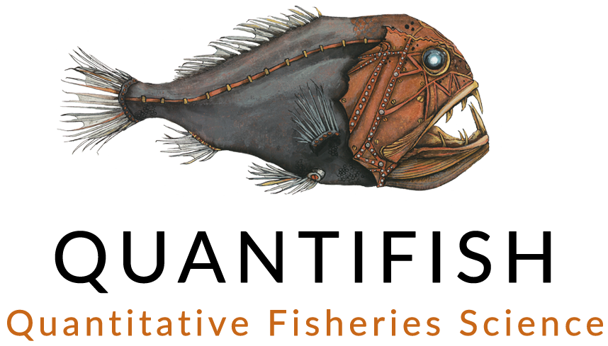
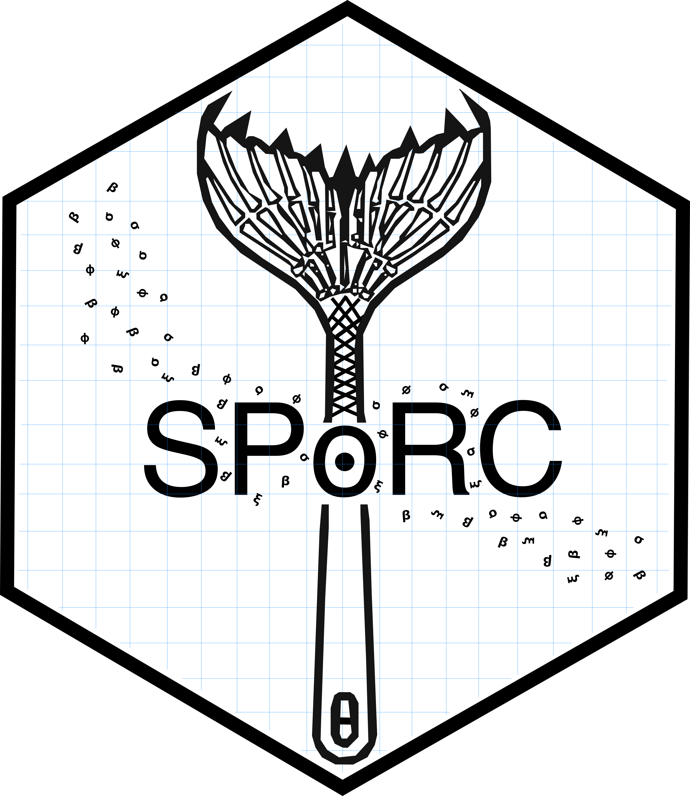
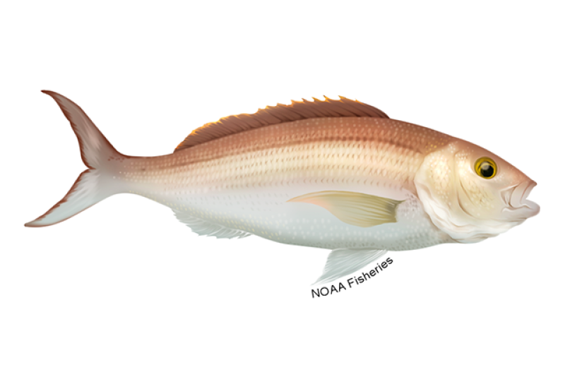

---
# Logo(s) shown top-right on every slide. logo2 is optional -- set a path
# (e.g. "static/partner-logo.png") if you want a second logo alongside the hex.
logo1: "static/opal-HEX-transparent.png"
logo2: ""

format:
  revealjs:
    theme: [default, customizations/presentation-custom.scss]
    slide-number: true
    footer: "WCPFC-SC22-2026/SA-WP-02"
    include-in-header:
      - text: |
          <script>
          window.opalLogos = {
            logo1: '',
            logo2: ''
          };
          </script>
          <script src="customizations/add-logos.js"></script>
          <script src="customizations/slide-background.js"></script>
          <script src="customizations/opal-branding.js"></script>
    css:
      - customizations/logos.css
    self-contained: true
resources:
  - "static/**"
revealjs-plugins:
  - codewindow
---

```{r}
#| label: setup
#| include: false
# All figures in this deck are pre-serialised ggplot/patchwork objects emitted
# by the working paper (single source of truth) and read here. Printing them
# needs only ggplot2 + patchwork -- no opal, RTMB, or result bundles at render
# time. See the README build recipe for how the report writes cached/pres/*.rds.
library(ggplot2)
library(patchwork)

knitr::opts_chunk$set(echo = FALSE, warning = FALSE, message = FALSE)

## Placeholder text colour (opal "truth" grey) for figures not yet built.
opal_truth <- "#4D4D4D"

## ---- cache location ------------------------------------------------------
# Quarto's execution directory can vary; anchor to the document's own dir.
doc_dir <- tryCatch(dirname(knitr::current_input(dir = TRUE)),
                    error = function(e) ".")
pres_cache_candidates <- c(
  file.path(doc_dir, "cached", "pres"),
  file.path(doc_dir, "assets", "cached", "pres"),
  file.path(getwd(),  "cached", "pres"),
  file.path(getwd(),  "assets", "cached", "pres")
)
pres_cache <- pres_cache_candidates[dir.exists(pres_cache_candidates)][1]
if (is.na(pres_cache)) pres_cache <- pres_cache_candidates[1]

## Read and print a pre-serialised figure object; placeholder if not built yet,
## so the deck always compiles.
show_cached_fig <- function(name) {
  f <- file.path(pres_cache, paste0(name, ".rds"))
  if (file.exists(f)) {
    print(readRDS(f))
  } else {
    ggplot() +
      annotate("text", x = 0, y = 0, size = 5, colour = opal_truth,
               label = paste0("Figure '", name, "' not built yet \u2014\nsee the README build recipe.")) +
      theme_void()
  }
}
```

## {.left-bg-image}

::: {.absolute top=15%}

[opal: the [o]{.opal-brand}pen [p]{.opal-brand}opulation [a]{.opal-brand}ssessment [l]{.opal-brand}ibrary]{.opal-subtitle style="font-size:1.2em;"}

<div style="font-size:0.7em; line-height:1.15; margin:0 0 1em;">
  N. Ducharme-Barth<sup>1</sup>, D. Webber<sup>2</sup><br>
  P. Neubauer<sup>3</sup>, K. Kim<sup>4</sup><br>
  A. Magnusson<sup>4</sup>, and P. Hamer<sup>4</sup>
</div>

<div style="font-size:0.35em; line-height:1.25; margin:0 0 1em;">
  <sup>1</sup> NOAA Fisheries, Pacific Islands Fisheries Science Center, Honolulu, USA<br>
  <sup>2</sup> Quantifish Limited, Tauranga, New Zealand<br>
  <sup>3</sup> Dragonfly Data Science, Wellington, New Zealand<br>
  <sup>4</sup> Oceanic Fisheries Programme, Pacific Community, Noumea, New Caledonia
</div>

[WCPFC-SC22 • Apia, Samoa • 11–19 August 2026]{.navy style="font-size:0.55em;"}


:::

{.absolute left=90% top=30% width=17%}

::: {.absolute left=0% bottom=5% width=100% style="display:flex; align-items:center; justify-content:space-between; gap:1.25rem;"}
{height=46px style="width:auto; border-radius:0;"}
{height=46px style="width:auto; border-radius:0;"}
{height=46px style="width:auto; border-radius:0;"}
{height=46px style="width:auto; border-radius:0;"}
{height=46px style="width:auto; border-radius:0;"}
:::

## What is `opal`? {.narrow-left-bg-image .smaller}

{.absolute left=31.25% top=15% width=37.5% style="opacity: 0.05; z-index: -1; border-radius: 0px;"}

::: {.incremental}
- `opal` — the [o]{.opal-brand}pen [p]{.opal-brand}opulation [a]{.opal-brand}ssessment [l]{.opal-brand}ibrary — is an open-source, modular R package for fisheries stock assessment.
- Built on `RTMB` for rapid prototyping, automatic differentiation, optimization, and random-effects estimation; it also supports Bayesian inference.
- Focused on diagnostics: estimability checks, one-step-ahead residuals, and simulation-based model checking.
- A single R codebase makes models straightforward to inspect, modify, and extend.
- Developed under [WCPFC Project 123]{.navy} as a [proof-of-concept]{.teal} for modular R-based assessment software.
:::

## Where did `opal` come from? {.narrow-left-bg-image .smaller}

::: {.absolute width=100% left=0% style="font-size:0.85em;"}

Builds on the established [[`sbt`]{.teal}](https://www.quantifish.co.nz/sbt/) package developed by [Quantifish](https://www.quantifish.co.nz/) for production [CCSBT](https://www.ccsbt.org/en) southern bluefin tuna stock assessments.
:::

::: {.absolute width=100% left=0% top=30% style="font-size:0.85em;"}
::: {.fragment .fade-in fragment-index=1}
Draws design influences from a number of existing assessment platforms:
:::
:::

::: {.absolute width=50% left=0% top=40% style="font-size:0.85em;"}

::: {.fragment .fade-in fragment-index=2}
- Stochastic Population over Regional Components model (SPoRC)
:::

::: {.fragment .fade-in fragment-index=3}
- Woods Hole Assessment Model (WHAM)
:::

::: {.fragment .fade-in fragment-index=4}
- Stock Synthesis ([SS3]{.navy})
:::

::: {.fragment .fade-in fragment-index=5}
- CASAL2
:::

::: {.fragment .fade-in fragment-index=6}
- MULTIFAN-CL ([MFCL]{.coral})
:::

:::

::: {.fragment .fade-out fragment-index=1}
{.absolute left=35% top=25% width=15% height=auto style="border-radius: 0px;"}
{.absolute left=15% top=55% width=25% height=auto style="border-radius: 0px;"}
{.absolute left=50% top=55% width=15% height=auto style="border-radius: 0px;"}
:::

::: {.fragment .fade-out fragment-index=3}
::: {.fragment .fade-in fragment-index=2}
{.absolute left=55% top=45% width=15% height=auto style="border-radius: 0px;"}
:::
:::

::: {.fragment .fade-out fragment-index=6}
::: {.fragment .fade-in fragment-index=5}
{.absolute left=55% top=65% width=25% height=auto style="border-radius: 0px;"}
:::
:::

## How is `opal` designed? {.narrow-left-bg-image .smaller}

::: {.absolute width=100% left=0% style="font-size:0.8em;"}
::: {.fragment .fade-out fragment-index=1}
A single objective function, [`opal_model()`]{.teal}, returns the negative log-likelihood — but orchestrates a sequence of standalone, individually documented [module functions]{.teal} rather than one monolithic routine.
:::
:::

::: {.absolute width=100% left=0% style="font-size:0.8em;"}
::: {.fragment .fade-out fragment-index=2}
::: {.fragment .fade-in fragment-index=1}
Population-model components — [growth]{.teal}, selectivity, recruitment, initial conditions, dynamics and harvest, the data likelihoods, and priors — are exported functions that can be modified, replaced, or tested in isolation
:::
:::
:::

::: {.absolute width=100% left=0% style="font-size:0.8em;"}
::: {.fragment .fade-out fragment-index=3}
::: {.fragment .fade-in fragment-index=2}
Written with `RTMB` so the same model code drives maximum-likelihood and Bayesian workflows, as well as [data simulation]{.teal}
:::
:::
:::

::: {.absolute width=100% left=0% style="font-size:0.8em;"}
::: {.fragment .fade-in fragment-index=3}
Intended to keep the codebase maintainable, human-readable, and open to community contribution; [continuous-integration checks]{.teal} run on every commit to the `main` or `dev` branches to ensure that the package builds and passes all tests
:::
:::


::: {.fragment .fade-out fragment-index=1}
:::: {.codewindow .absolute left=5% top=27.5% width=90%}
::: {.editor .r name="model.R"}
```r
#' The opal model
#' 
#' Obtain the negative log-likelihood (NLL) value from the opal model.
#' 
#' @param parameters a \code{list} of parameter values.
#' @param data a \code{list} of data inputs.
#' @return the negative log-likelihood (NLL) value.
#' @importFrom RTMB ADoverload getAll REPORT ADREPORT
#' @export
#' 
opal_model <- function(parameters, data) {
  # ... parameter initialization ...
  getAll(data, parameters, warn = FALSE)
  
  # Growth module ----
  # Back-transform growth/variability parameters
  L1 <- exp(log_L1); L2 <- exp(log_L2)

  # Module 1: Mean length-at-age (Schnute VB)
  mu_a <- get_growth(n_age, A1, A2, L1, L2, log_k)

  # ... other modules (weight, maturity, selectivity, dynamics, likelihoods, etc.) would be called here ...
  return(nll)
}
```
:::

::: {.editor .r name="growth.R"}
```r
#' Compute mean length-at-age using the Schnute parameterization of VB growth
#'
#' Uses the Schnute parameterization of the von Bertalanffy growth curve,
#' matching the SS3 formulation with \code{CV_Growth_Pattern = 2}.
#'
#' @param n_age Integer. Number of age classes.
#' @param A1 Integer. Reference age for L1 (data).
#' @param A2 Integer. Reference age for L2 (data).
#' @param L1 Numeric. Length at age A1 (may be AD).
#' @param L2 Numeric. Length at age A2 (may be AD).
#' @param log_k Numeric. VB growth coefficient (may be AD).
#' @param min_age Integer. Minimum age (default 1L).
#' @return Numeric vector of length \code{n_age}: mean length at each age
#'   \code{a = min_age, ..., min_age + n_age - 1}.
#' @export
get_growth <- function(n_age, A1, A2, L1, L2, log_k, min_age = 1L) {
  ages <- seq(min_age, by = 1, length.out = n_age)
  k   <- exp(log_k)
  mu_a <- L1 + (L2 - L1) * (1 - exp(-k * (ages - A1))) / (1 - exp(-k * (A2 - A1)))
  return(mu_a)
}
```
:::

::: {.editor .r name="likelihoods.R"}
```r
get_cpue_like <- function(cpue_data, parameters, number_ysa, sel_fya, weight_fya, cpue_switch = 1L) {
  
  # ... caculate predicted CPUE based on model dynamics and selectivity ...

  # mark the data observations using OBS() for automated simulation given the defined likelihood
  cpue_log_obs <- log(cpue_data$value)
  cpue_log_obs <- OBS(cpue_log_obs)

  # calculate the negative log-likelihood for CPUE data
  if (cpue_switch > 0) {
    lp[] <- -dnorm(x = cpue_log_obs, mean = cpue_log_pred, sd = cpue_sigma, log = TRUE)
  }
  cpue_pred <- exp(cpue_log_pred)

  # report predicted CPUE and its standard deviation
  REPORT(cpue_pred)
  REPORT(cpue_sigma)
  return(lp = lp)
}
```
:::
::: {.editor .r name="test-growth.R"}
```r
test_that("full pipeline: weight-at-age is positive and increasing over young ages", {
  mu_a <- get_growth(n_age, A1, A2, L1, L2, k)
  sd_a <- get_sd_at_age(mu_a, L1, L2, CV1, CV2)
  pla  <- get_pla(len_lower, len_upper, mu_a, sd_a)
  lw_a_par <- 1.15 * 2.942e-06
  lw_b_par <- 3.13088
  wt_at_len <- get_weight_at_length(len_mid, lw_a_par, lw_b_par)
  weight_a  <- as.vector(t(pla) %*% wt_at_len)
  expect_equal(length(weight_a), n_age)
  expect_true(all(weight_a > 0))
  # Weight should be increasing over first half of ages (young fish growing fast)
  expect_true(all(diff(weight_a[1:20]) > 0))
})

test_that("full pipeline: maturity-at-age is consistent with direct pla conversion", {
  mu_a <- get_growth(n_age, A1, A2, L1, L2, k)
  sd_a <- get_sd_at_age(mu_a, L1, L2, CV1, CV2)
  pla  <- get_pla(len_lower, len_upper, mu_a, sd_a)
  mat_l <- pmin(pmax(len_mid / 150, 0), 1)  # simple ramp maturity
  # Direct conversion
  mat_a_direct <- as.vector(t(pla) %*% mat_l)
  # Via get_maturity_at_age
  mat_a_module <- get_maturity_at_age(pla, mat_l)
  expect_equal(mat_a_module, mat_a_direct, tolerance = 1e-12)
})
```
:::
::::
:::

::: {.fragment .fade-out fragment-index=2}
::: {.fragment .fade-in fragment-index=1}
:::: {.codewindow .absolute left=5% top=27.5% width=90%}
::: {.editor .r name="model.R"}
```r
#' The opal model
#' 
#' Obtain the negative log-likelihood (NLL) value from the opal model.
#' 
#' @param parameters a \code{list} of parameter values.
#' @param data a \code{list} of data inputs.
#' @return the negative log-likelihood (NLL) value.
#' @importFrom RTMB ADoverload getAll REPORT ADREPORT
#' @export
#' 
opal_model <- function(parameters, data) {
  # ... parameter initialization ...
  getAll(data, parameters, warn = FALSE)
  
  # Growth module ----
  # Back-transform growth/variability parameters
  L1 <- exp(log_L1); L2 <- exp(log_L2)

  # Module 1: Mean length-at-age (Schnute VB)
  mu_a <- get_growth(n_age, A1, A2, L1, L2, log_k)

  # ... other modules (weight, maturity, selectivity, dynamics, likelihoods, etc.) would be called here ...
  return(nll)
}
```
:::

::: {.editor .r .active name="growth.R"}
```r
#' Compute mean length-at-age using the Schnute parameterization of VB growth
#'
#' Uses the Schnute parameterization of the von Bertalanffy growth curve,
#' matching the SS3 formulation with \code{CV_Growth_Pattern = 2}.
#'
#' @param n_age Integer. Number of age classes.
#' @param A1 Integer. Reference age for L1 (data).
#' @param A2 Integer. Reference age for L2 (data).
#' @param L1 Numeric. Length at age A1 (may be AD).
#' @param L2 Numeric. Length at age A2 (may be AD).
#' @param log_k Numeric. VB growth coefficient (may be AD).
#' @param min_age Integer. Minimum age (default 1L).
#' @return Numeric vector of length \code{n_age}: mean length at each age
#'   \code{a = min_age, ..., min_age + n_age - 1}.
#' @export
get_growth <- function(n_age, A1, A2, L1, L2, log_k, min_age = 1L) {
  ages <- seq(min_age, by = 1, length.out = n_age)
  k   <- exp(log_k)
  mu_a <- L1 + (L2 - L1) * (1 - exp(-k * (ages - A1))) / (1 - exp(-k * (A2 - A1)))
  return(mu_a)
}
```
:::

::: {.editor .r name="likelihoods.R"}
```r
get_cpue_like <- function(cpue_data, parameters, number_ysa, sel_fya, weight_fya, cpue_switch = 1L) {
  
  # ... caculate predicted CPUE based on model dynamics and selectivity ...

  # mark the data observations using OBS() for automated simulation given the defined likelihood
  cpue_log_obs <- log(cpue_data$value)
  cpue_log_obs <- OBS(cpue_log_obs)

  # calculate the negative log-likelihood for CPUE data
  if (cpue_switch > 0) {
    lp[] <- -dnorm(x = cpue_log_obs, mean = cpue_log_pred, sd = cpue_sigma, log = TRUE)
  }
  cpue_pred <- exp(cpue_log_pred)

  # report predicted CPUE and its standard deviation
  REPORT(cpue_pred)
  REPORT(cpue_sigma)
  return(lp = lp)
}
```
:::
::: {.editor .r name="test-growth.R"}
```r
test_that("full pipeline: weight-at-age is positive and increasing over young ages", {
  mu_a <- get_growth(n_age, A1, A2, L1, L2, k)
  sd_a <- get_sd_at_age(mu_a, L1, L2, CV1, CV2)
  pla  <- get_pla(len_lower, len_upper, mu_a, sd_a)
  lw_a_par <- 1.15 * 2.942e-06
  lw_b_par <- 3.13088
  wt_at_len <- get_weight_at_length(len_mid, lw_a_par, lw_b_par)
  weight_a  <- as.vector(t(pla) %*% wt_at_len)
  expect_equal(length(weight_a), n_age)
  expect_true(all(weight_a > 0))
  # Weight should be increasing over first half of ages (young fish growing fast)
  expect_true(all(diff(weight_a[1:20]) > 0))
})

test_that("full pipeline: maturity-at-age is consistent with direct pla conversion", {
  mu_a <- get_growth(n_age, A1, A2, L1, L2, k)
  sd_a <- get_sd_at_age(mu_a, L1, L2, CV1, CV2)
  pla  <- get_pla(len_lower, len_upper, mu_a, sd_a)
  mat_l <- pmin(pmax(len_mid / 150, 0), 1)  # simple ramp maturity
  # Direct conversion
  mat_a_direct <- as.vector(t(pla) %*% mat_l)
  # Via get_maturity_at_age
  mat_a_module <- get_maturity_at_age(pla, mat_l)
  expect_equal(mat_a_module, mat_a_direct, tolerance = 1e-12)
})
```
:::
::::
:::
:::

::: {.fragment .fade-out fragment-index=3}
::: {.fragment .fade-in fragment-index=2}
:::: {.codewindow .absolute left=5% top=27.5% width=90%}
::: {.editor .r name="model.R"}
```r
#' The opal model
#' 
#' Obtain the negative log-likelihood (NLL) value from the opal model.
#' 
#' @param parameters a \code{list} of parameter values.
#' @param data a \code{list} of data inputs.
#' @return the negative log-likelihood (NLL) value.
#' @importFrom RTMB ADoverload getAll REPORT ADREPORT
#' @export
#' 
opal_model <- function(parameters, data) {
  # ... parameter initialization ...
  getAll(data, parameters, warn = FALSE)
  
  # Growth module ----
  # Back-transform growth/variability parameters
  L1 <- exp(log_L1); L2 <- exp(log_L2)

  # Module 1: Mean length-at-age (Schnute VB)
  mu_a <- get_growth(n_age, A1, A2, L1, L2, log_k)

  # ... other modules (weight, maturity, selectivity, dynamics, likelihoods, etc.) would be called here ...
  return(nll)
}
```
:::

::: {.editor .r name="growth.R"}
```r
#' Compute mean length-at-age using the Schnute parameterization of VB growth
#'
#' Uses the Schnute parameterization of the von Bertalanffy growth curve,
#' matching the SS3 formulation with \code{CV_Growth_Pattern = 2}.
#'
#' @param n_age Integer. Number of age classes.
#' @param A1 Integer. Reference age for L1 (data).
#' @param A2 Integer. Reference age for L2 (data).
#' @param L1 Numeric. Length at age A1 (may be AD).
#' @param L2 Numeric. Length at age A2 (may be AD).
#' @param log_k Numeric. VB growth coefficient (may be AD).
#' @param min_age Integer. Minimum age (default 1L).
#' @return Numeric vector of length \code{n_age}: mean length at each age
#'   \code{a = min_age, ..., min_age + n_age - 1}.
#' @export
get_growth <- function(n_age, A1, A2, L1, L2, log_k, min_age = 1L) {
  ages <- seq(min_age, by = 1, length.out = n_age)
  k   <- exp(log_k)
  mu_a <- L1 + (L2 - L1) * (1 - exp(-k * (ages - A1))) / (1 - exp(-k * (A2 - A1)))
  return(mu_a)
}
```
:::

::: {.editor .r .active name="likelihoods.R"}
```r
get_cpue_like <- function(cpue_data, parameters, number_ysa, sel_fya, weight_fya, cpue_switch = 1L) {
  
  # ... caculate predicted CPUE based on model dynamics and selectivity ...

  # mark the data observations using OBS() for automated simulation given the defined likelihood
  cpue_log_obs <- log(cpue_data$value)
  cpue_log_obs <- OBS(cpue_log_obs)

  # calculate the negative log-likelihood for CPUE data
  if (cpue_switch > 0) {
    lp[] <- -dnorm(x = cpue_log_obs, mean = cpue_log_pred, sd = cpue_sigma, log = TRUE)
  }
  cpue_pred <- exp(cpue_log_pred)

  # report predicted CPUE and its standard deviation
  REPORT(cpue_pred)
  REPORT(cpue_sigma)
  return(lp = lp)
}
```
:::
::: {.editor .r name="test-growth.R"}
```r
test_that("full pipeline: weight-at-age is positive and increasing over young ages", {
  mu_a <- get_growth(n_age, A1, A2, L1, L2, k)
  sd_a <- get_sd_at_age(mu_a, L1, L2, CV1, CV2)
  pla  <- get_pla(len_lower, len_upper, mu_a, sd_a)
  lw_a_par <- 1.15 * 2.942e-06
  lw_b_par <- 3.13088
  wt_at_len <- get_weight_at_length(len_mid, lw_a_par, lw_b_par)
  weight_a  <- as.vector(t(pla) %*% wt_at_len)
  expect_equal(length(weight_a), n_age)
  expect_true(all(weight_a > 0))
  # Weight should be increasing over first half of ages (young fish growing fast)
  expect_true(all(diff(weight_a[1:20]) > 0))
})

test_that("full pipeline: maturity-at-age is consistent with direct pla conversion", {
  mu_a <- get_growth(n_age, A1, A2, L1, L2, k)
  sd_a <- get_sd_at_age(mu_a, L1, L2, CV1, CV2)
  pla  <- get_pla(len_lower, len_upper, mu_a, sd_a)
  mat_l <- pmin(pmax(len_mid / 150, 0), 1)  # simple ramp maturity
  # Direct conversion
  mat_a_direct <- as.vector(t(pla) %*% mat_l)
  # Via get_maturity_at_age
  mat_a_module <- get_maturity_at_age(pla, mat_l)
  expect_equal(mat_a_module, mat_a_direct, tolerance = 1e-12)
})
```
:::
::::
:::
:::

::: {.fragment .fade-in fragment-index=3}
:::: {.codewindow .absolute left=5% top=27.5% width=90%}
::: {.editor .r name="model.R"}
```r
#' The opal model
#' 
#' Obtain the negative log-likelihood (NLL) value from the opal model.
#' 
#' @param parameters a \code{list} of parameter values.
#' @param data a \code{list} of data inputs.
#' @return the negative log-likelihood (NLL) value.
#' @importFrom RTMB ADoverload getAll REPORT ADREPORT
#' @export
#' 
opal_model <- function(parameters, data) {
  # ... parameter initialization ...
  getAll(data, parameters, warn = FALSE)
  
  # Growth module ----
  # Back-transform growth/variability parameters
  L1 <- exp(log_L1); L2 <- exp(log_L2)

  # Module 1: Mean length-at-age (Schnute VB)
  mu_a <- get_growth(n_age, A1, A2, L1, L2, log_k)

  # ... other modules (weight, maturity, selectivity, dynamics, likelihoods, etc.) would be called here ...
  return(nll)
}
```
:::

::: {.editor .r name="growth.R"}
```r
#' Compute mean length-at-age using the Schnute parameterization of VB growth
#'
#' Uses the Schnute parameterization of the von Bertalanffy growth curve,
#' matching the SS3 formulation with \code{CV_Growth_Pattern = 2}.
#'
#' @param n_age Integer. Number of age classes.
#' @param A1 Integer. Reference age for L1 (data).
#' @param A2 Integer. Reference age for L2 (data).
#' @param L1 Numeric. Length at age A1 (may be AD).
#' @param L2 Numeric. Length at age A2 (may be AD).
#' @param log_k Numeric. VB growth coefficient (may be AD).
#' @param min_age Integer. Minimum age (default 1L).
#' @return Numeric vector of length \code{n_age}: mean length at each age
#'   \code{a = min_age, ..., min_age + n_age - 1}.
#' @export
get_growth <- function(n_age, A1, A2, L1, L2, log_k, min_age = 1L) {
  ages <- seq(min_age, by = 1, length.out = n_age)
  k   <- exp(log_k)
  mu_a <- L1 + (L2 - L1) * (1 - exp(-k * (ages - A1))) / (1 - exp(-k * (A2 - A1)))
  return(mu_a)
}
```
:::

::: {.editor .r name="likelihoods.R"}
```r
get_cpue_like <- function(cpue_data, parameters, number_ysa, sel_fya, weight_fya, cpue_switch = 1L) {
  
  # ... caculate predicted CPUE based on model dynamics and selectivity ...

  # mark the data observations using OBS() for automated simulation given the defined likelihood
  cpue_log_obs <- log(cpue_data$value)
  cpue_log_obs <- OBS(cpue_log_obs)

  # calculate the negative log-likelihood for CPUE data
  if (cpue_switch > 0) {
    lp[] <- -dnorm(x = cpue_log_obs, mean = cpue_log_pred, sd = cpue_sigma, log = TRUE)
  }
  cpue_pred <- exp(cpue_log_pred)

  # report predicted CPUE and its standard deviation
  REPORT(cpue_pred)
  REPORT(cpue_sigma)
  return(lp = lp)
}
```
:::

::: {.editor .r .active name="test-growth.R"}
```r
test_that("full pipeline: weight-at-age is positive and increasing over young ages", {
  mu_a <- get_growth(n_age, A1, A2, L1, L2, k)
  sd_a <- get_sd_at_age(mu_a, L1, L2, CV1, CV2)
  pla  <- get_pla(len_lower, len_upper, mu_a, sd_a)
  lw_a_par <- 1.15 * 2.942e-06
  lw_b_par <- 3.13088
  wt_at_len <- get_weight_at_length(len_mid, lw_a_par, lw_b_par)
  weight_a  <- as.vector(t(pla) %*% wt_at_len)
  expect_equal(length(weight_a), n_age)
  expect_true(all(weight_a > 0))
  # Weight should be increasing over first half of ages (young fish growing fast)
  expect_true(all(diff(weight_a[1:20]) > 0))
})

test_that("full pipeline: maturity-at-age is consistent with direct pla conversion", {
  mu_a <- get_growth(n_age, A1, A2, L1, L2, k)
  sd_a <- get_sd_at_age(mu_a, L1, L2, CV1, CV2)
  pla  <- get_pla(len_lower, len_upper, mu_a, sd_a)
  mat_l <- pmin(pmax(len_mid / 150, 0), 1)  # simple ramp maturity
  # Direct conversion
  mat_a_direct <- as.vector(t(pla) %*% mat_l)
  # Via get_maturity_at_age
  mat_a_module <- get_maturity_at_age(pla, mat_l)
  expect_equal(mat_a_module, mat_a_direct, tolerance = 1e-12)
})
```
:::
::::
:::


## What can `opal` currently do? {.narrow-left-bg-image .smaller}

{.absolute left=31.25% top=15% width=37.5% style="opacity: 0.05; z-index: -1; border-radius: 0px;"}

::: {.incremental}
- Estimates [age-structured]{.teal} population dynamics with [length-based]{.teal} processes
- Fits CPUE together with length- and weight-composition data, under a choice of likelihoods
- Composition likelihoods: multinomial, Dirichlet, and Dirichlet-multinomial
- Supports [random-effects]{.teal} estimation, catch-based [projections]{.teal}, and [Bayesian]{.teal} inference via `SparseNUTS`
- Built-in diagnostics: estimability and parameter-correlation checks, simulation self-testing, posterior-predictive checks, and one-step-ahead (OSA) residuals
- Produces comparable results to both [SS3]{.navy} and [MFCL]{.coral} when fitting the same data and model structure
- Can handle the dimensionality and data-volume of a full tropical tuna stock assessment
:::

::: {.fragment .fade-in}
::: {.absolute left="-2.5%" top="15%" bottom="-2.5%" width="105%" style="background-color: rgba(255, 255, 255, 0.8);"}

:::
::: {.absolute left="10%" top="40%" right="10%" style="font-size:1.1em; padding: 0.5em 1em; background-color: rgba(214, 227, 251, 1); box-shadow: 0 0 1rem 0 rgba(0, 0, 0, .5); border-radius: 15px;"}
These features are demonstrated using two case studies: a [simulated]{.navy} single-species assessment and a [real-data]{.navy} tuna assessment.
:::
:::

## 'Opakapaka — case study {.narrow-left-bg-image .smaller}

::: {.absolute width=100% left=0% style="font-size:0.8em;"}
Simulated data for Hawai'i 'opakapaka (*Pristipomoides filamentosus*), with true dynamics known from an [SS3]{.navy} operating model
:::

{.absolute .fragment .move-fish fragment-index=1 left=31% top=25% width=38%}

::: {.absolute width=60% top=25% left=0% style="font-size:0.8em;"}
::: {.fragment .fade-in fragment-index=1}
- Annual model (1949–2023) with three fleets (commercial, non-commercial, research survey)
:::
::: {.fragment .fade-in fragment-index=2}
- Fitted to two CPUE indices (negligible observation error) plus commercial and survey length compositions
:::
::: {.fragment .fade-in fragment-index=3}
- Two opal models fitted: a [fixed-effects]{.teal} version and a [random-effects]{.teal} version (recruitment and initial age deviations estimated as random effects)
:::
::: {.fragment .fade-in fragment-index=4}
- Doubles as a cross-platform check: `opal` vs the [SS3]{.navy} estimation model and the operating-model truth under identical inputs
:::

:::

::: {.fragment .fade-in fragment-index=5}
::: {.absolute bottom=1% width=94%}
::: {.callout-important}
Illustrative only — **not** intended to inform management advice.
:::
:::
:::

## 'Opakapaka — opal fit {.narrow-left-bg-image .smaller}

::: {.absolute .fit-figure left=3% top=15% width=62% height=60% style="box-shadow: 0 0 1rem 0 rgba(0, 0, 0, .5); border-radius: 3px;"}

```{r}
#| label: paka-biomass
#| fig-width: 8.5
#| fig-height: 5
show_cached_fig("paka-biomass")
```

:::

::: {.absolute top=26% left=70% width=30%}
::: {.fragment .fade-in fragment-index=1}
::: {.callout-note}
## Result
`opal` reproduced the [SS3]{.navy} simulated spawning-biomass trajectory and the known truth.
:::
:::
:::

::: {.absolute top=80% left=3% width=62% style="font-size:0.58em;" .muted}
Both opal models converged with all parameters identifiable

Convergence with SE calculations was rapid (FE ~2 seconds, RE ~2 minutes; with both opal models faster than the ~6 min [SS3]{.navy} model)
:::

## Example diagnostics {.narrow-left-bg-image .smaller}

::: {.absolute .fit-figure left=3% top=15% width=94% height=60% style="box-shadow: 0 0 1rem 0 rgba(0, 0, 0, .5); border-radius: 3px;"}

```{r}
#| label: paka-cpue-ppc
#| fig-width: 9
#| fig-height: 3.8
show_cached_fig("paka-cpue-ppc")
```
:::

::: {.absolute top=80% left=3% width=94% style="font-size:0.58em;" .muted}
[A]{.teal} Simulated 'opakapaka commercial CPUE using `RTMB`'s `simulate()` feature with `OBS()` marked data

[B]{.teal} Distribution of simulated relative to observed CPUE

[C]{.teal} PIT ECDF of simulated relative to observed CPUE
:::

## Bayesian inference and projections {.narrow-left-bg-image .smaller}

::: {.absolute .fit-figure left=3% top=15% width=62% height=60% style="box-shadow: 0 0 1rem 0 rgba(0, 0, 0, .5); border-radius: 3px;"}

```{r}
#| label: paka-proj
#| fig-width: 8.5
#| fig-height: 5
show_cached_fig("paka-proj")
```
:::

::: {.absolute top=80% left=3% width=62% style="font-size:0.58em;" .muted}

Historical uncertainty and a 10-year constant-catch projection of 'opakapaka spawning biomass: opal [maximum-likelihood]{.teal}, opal [Bayesian]{.gold}, [SS3 operating model]{.grey}, and [SS3 estimation model]{.navy}. Coloured ribbons give the uncertainty for the opal [maximum-likelihood]{.teal} and [Bayesian]{.gold} approaches. The vertical dashed line marks the end of the historical period.
:::

::: {.absolute top=15% width=30% left=70% style="font-size:0.8em;"}

::: {.incremental}
- Bayesian estimation possible through `RTMB` using the `SparseNUTS` package
- The *same* `RTMB` model code serves both the [maximum-likelihood]{.teal} and [Bayesian]{.gold} workflows
- Catch-based projections with future recruitment deviations resampled from recent years
- Parameter uncertainty propagated two ways: a [multivariate-normal]{.teal} approximation at the mode, or a [posterior sample]{.gold} from MCMC
:::

:::

## Bigeye tuna — case study {.narrow-left-bg-image .smaller}

::: {.absolute width=100% left=0% style="font-size:0.8em;"}
Real data from the fleets-as-areas model in the 2020 WCPO bigeye tuna (*Thunnus obesus*) assessment
:::

{.absolute .fragment .move-fish fragment-index=1 left=31% top=25% width=38% style="filter: blur(0px) saturate(0.75)brightness(1.12) contrast(0.9); opacity: 0.88; box-shadow: 0 0 1rem 0 rgba(0, 0, 0, .35); border-radius: 15px;"}

::: {.absolute width=60% top=25% left=0% style="font-size:0.65em;"}
::: {.fragment .fade-in fragment-index=1}
- Model dynamics specified [15]{.navy} fisheries, [268]{.navy} time-steps, [40]{.navy} quarterly age-classes, [95]{.navy} length-bins, and [200]{.navy} weight-bins.
:::
::: {.fragment .fade-in fragment-index=2}
- The opal model fit to [4]{.navy} quarterly CPUE indices, [1,194]{.navy} weight-frequency instances and [568]{.navy} length-frequency instances
:::
::: {.fragment .fade-in fragment-index=3}
- Population scale, recruitment deviations, quarterly catchability, and selected selectivity parameters were estimated
:::
::: {.fragment .fade-in fragment-index=4}
- The opal model converged with a near-zero gradient. However, diagnostics indicated several selectivity parameters were weakly identifiable and these were fixed to obtain stable Hessian-based uncertainty estimates
:::
::: {.fragment .fade-in fragment-index=5}
- A second opal model was configured with a simplified fishery structure (six aggregated fisheries) and a reduced number of selectivity parameters, which converged with all parameters identifiable
:::

:::

::: {.fragment .fade-in fragment-index=6}
::: {.absolute bottom=10% left=62% width=36%}
::: {.callout-important}
Illustrative only — **not** intended to inform management advice.
:::
:::
:::

## Bigeye tuna — opal fit {.narrow-left-bg-image .smaller}

::: {.absolute .fit-figure left=3% top=15% width=62% height=60% style="box-shadow: 0 0 1rem 0 rgba(0, 0, 0, .5); border-radius: 3px;"}

```{r}
#| label: bet-cpue-fit
#| fig-width: 8.5
#| fig-height: 5
show_cached_fig("bet-cpue-fit")
```

:::

::: {.absolute top=26% left=70% width=30%}
::: {.fragment .fade-in fragment-index=1}
::: {.callout-note}
## Result
• Both `opal` models produced better fits to the CPUE indices than either the [MFCL]{.coral} or [SS3]{.navy} models

• This is likely due to down-weighting of the composition likelihoods relative to the other models.
:::
:::
:::

::: {.absolute top=80% left=3% width=62% style="font-size:0.58em;" .muted}
Observed, predicted, and simulated standardized CPUE for the fitted opal WCPO bigeye tuna [15-fishery]{.teal} and [6-fishery]{.gold} models. Vertical error bars show one fitted standard deviation on the log scale; [light teal]{.sim} lines show fitted-model simulations from the [15-fishery]{.teal} model. Illustrative fits by corresponding [MFCL]{.coral} and [SS3]{.navy} models are also shown. The RMSE of the log-residuals is shown for each model and index month.
:::

## Bigeye tuna — model comparison {.narrow-left-bg-image .smaller}

::: {.absolute .fit-figure left=0% top=15% width=97% height=60% style="box-shadow: 0 0 1rem 0 rgba(0, 0, 0, .5); border-radius: 3px;"}

```{r}
#| label: bet-biomass
#| fig-width: 9
#| fig-height: 3.6
show_cached_fig("bet-biomass")
```

:::

::: {.absolute top=75% left=3% width=62% style="font-size:0.58em;" .muted}
Estimated spawning biomass and relative biomass trajectories for the fitted opal WCPO bigeye tuna [15-fishery]{.teal} and [6-fishery]{.gold} models. Shaded ribbons show approximate 95% intervals from model-based standard errors; the opal ribbon uses `RTMB::sdreport()` with a supplied positive-definite fixed-effect Hessian. Illustrative fits by corresponding [MFCL]{.coral} and [SS3]{.navy} models are also shown.
:::

::: {.fragment .fade-in fragment-index=1}
::: {.absolute left="-2.5%" top="12.5%" bottom="-2.5%" width="105%" style="background-color: rgba(255, 255, 255, 0.7);"}
:::
:::

::: {.absolute top=30% left=25% width=50%}
::: {.fragment .fade-in fragment-index=1}
::: {.callout-note style="font-size:1.2em; background-color: rgba(214, 227, 251, 1);"}
## Result
• opal can handle real tuna data

• Both `opal` models produced trajectories comparable to the [MFCL]{.coral} and [SS3]{.navy} models.
:::
:::
:::

## Summary {.narrow-left-bg-image .smaller}

{.absolute left=31.25% top=15% width=37.5% style="opacity: 0.05; z-index: -1; border-radius: 0px;"}

::: {.absolute width=48% left=0% top=16% style="font-size:0.9em;"}

[What the case studies show]{.teal}

::: {.incremental}
- Estimates population dynamics and reproduces a known simulated truth
- Produces comparable results to both [SS3]{.navy} and [MFCL]{.coral} when fitting the same data
- Handles the data volume and dimensionality of a real tuna assessment
- Benefits of `RTMB` foundation: facilitates diagnostics, random effects, and Bayesian inference
:::

:::

::: {.absolute width=48% left=52% top=16% style="font-size:0.9em;"}

[Outstanding challenges]{.coral}

::: {.incremental}
- Improving optimization robustness to naive starting values
- Scaling random effects to higher-dimensional models
- Ongoing code optimization
:::

:::

## Next steps {.narrow-left-bg-image .smaller}

{.absolute left=31.25% top=15% width=37.5% style="opacity: 0.05; z-index: -1; border-radius: 0px;"}

::: {.absolute width=48% left=0% top=15% style="font-size:0.9em;"}

[Ongoing work]{.teal}

::: {.incremental}
- User-interface refinement and additional case studies
- Reference points
- Additional likelihoods (age, tag, close-kin)
- Alternative selectivity forms
- Added population dimensionality (space, sex, length)
- Implementation within WCPFC: north Pacific blue shark, or south Pacific albacore in a research capacity
:::

:::

::: {.absolute width=48% left=52% top=15% style="font-size:0.9em;"}

[We invite SC22 to]{.navy}

::: {.incremental}
- [Note]{.navy} the development of `opal` and its two case studies
- [Comment]{.navy} on its suitability for tuna, shark, and billfish assessments
- [Endorse]{.navy} continued development as a core stream for next-generation tuna assessment software
:::

:::

## Acknowledgements {.narrow-left-bg-image .smaller}

::: {.absolute width=96% left=2% top=15% style="font-size:0.72em; text-align:center;"}

Source code, documentation, and worked examples are open-source:

[Website](https://connect.fisheries.noaa.gov/opal/) · <https://connect.fisheries.noaa.gov/opal/>

:::

{.absolute left=42.5% top=30% width=15% style="box-shadow: 0 0 1rem 0 rgba(0, 0, 0, .5); border-radius: 15px;"}

::: {.absolute width=96% left=2% top=57.5% style="font-size:0.72em; text-align:center;"}
::: {.fragment .fade-in fragment-index=1}
Development is an open, collaborative effort. We thank the many contributors through informal discussions and update meetings — including N. Davies, S. Hoyle, M. Maunder, R. Bi, F. Carvalho, G. Pilling, J. Hampton, and participants in the 2025 CAPAM mini-workshop and 2026 SPC Pre-Assessment Workshop — and [WCPFC Project 123]{.navy} for funding support.
:::
:::

::: {.fragment .fade-in fragment-index=1}
::: {.absolute left=0% bottom=5% width=100% style="display:flex; align-items:center; justify-content:space-between; gap:1.25rem;"}
{height=56px style="width:auto; border-radius:0;"}
{height=56px style="width:auto; border-radius:0;"}
{height=56px style="width:auto; border-radius:0;"}
{height=56px style="width:auto; border-radius:0;"}
{height=56px style="width:auto; border-radius:0;"}
:::
:::
